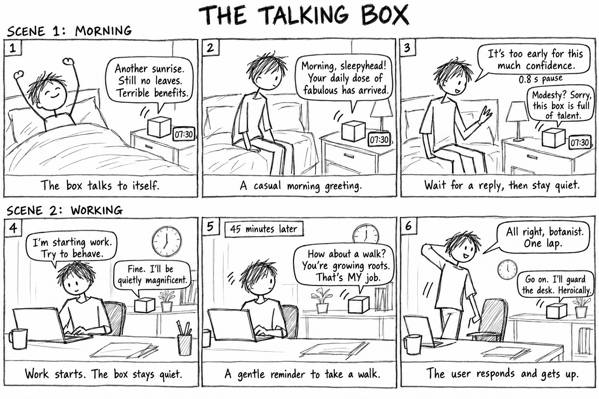
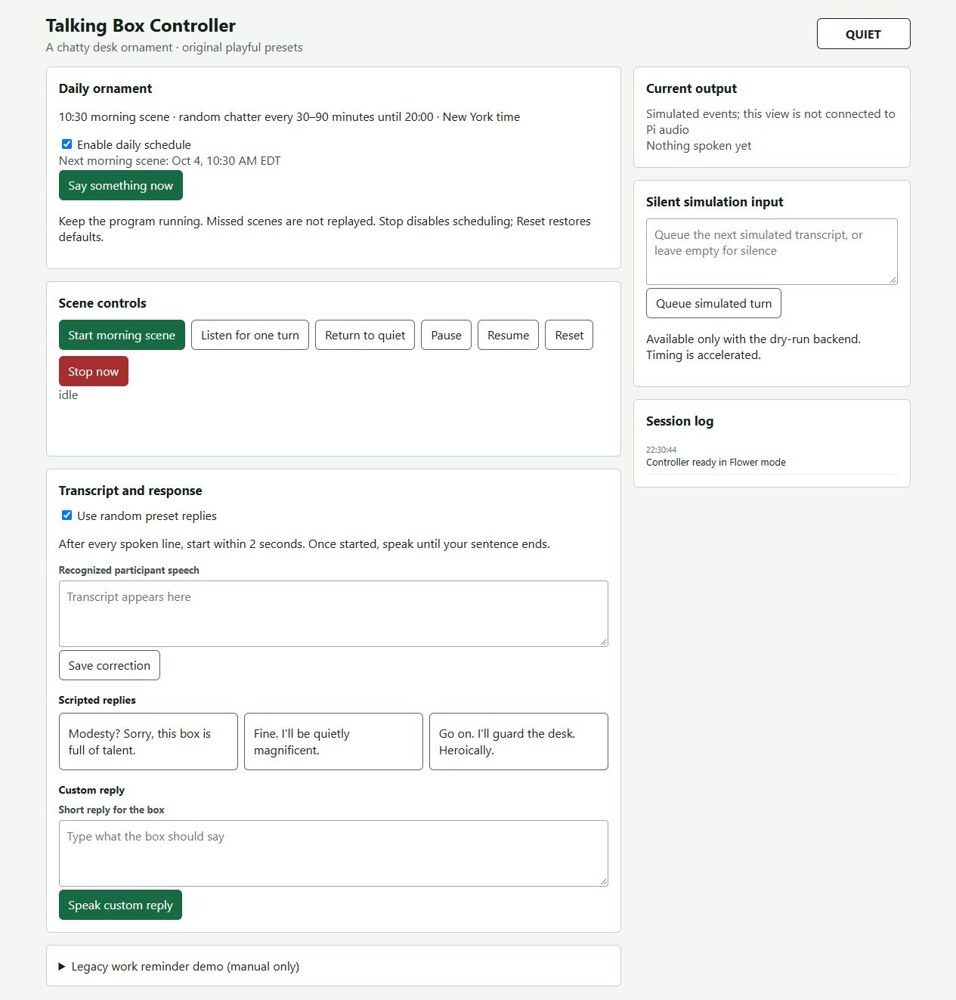

# Chatterboxes

**Author: Hanle.**

**Collaborators / References:** During the ideation phase, I referenced [Talking Flower by manaporkun](https://github.com/manaporkun/talking-flower) and [The Babbling Brook by MIT Media Lab](https://github.com/mitmedialab/TheBabblingBrook) for inspiration.

[Course README](https://github.com/Mmmmmmarius/Interactive-Lab-Hub/tree/Fall2026/Lab%203)

The Talking Box is a speech-enabled decoration with a playful, slightly self-important personality inspired by Talking Flower. It offers occasional company through short remarks and teasing replies.

<details>
<summary>Lab overview and requirements</summary>

In this lab, we want you to design interaction with a speech-enabled device — something that listens and talks to you. This device can do anything *but* control lights (since we already did that in Lab 1). First, we want you to storyboard what you imagine the conversational interaction to be like. Then you will use wizarding techniques to elicit examples of what people might say, ask, or respond. We then want you to use the examples collected from at least two other people to inform the redesign of the device.

We will focus on **audio** as the main modality for interaction to start; these general techniques can be extended to **video**, **haptics** or other interactive mechanisms in the second part of the Lab.

A note on what you are building with. Speech interfaces are usually taught as two boxes — speech-in, speech-out — and that framing hides the part that actually determines whether an interaction works. Between listening and speaking sits the question of **whose turn it is**: when does the device decide you have finished talking, and how long does it make you wait before it answers? This lab gives you direct control over both, and we will ask you to notice what changes when you move them.

</details>

## Prep for Part 1: Get the Latest Content and Pick up Additional Parts

<details>
<summary>Preparation instructions</summary>

Please check instructions in [prep.md](https://github.com/Mmmmmmarius/Interactive-Lab-Hub/blob/Fall2026/Lab%203/prep.md) and complete the setup.

### Pick up Web Camera If You Don't Have One

Students who have not already received a web camera will receive their Webcam and at the beginning of lab. If you cannot make it to class this week, please contact the TAs to ensure you get these.

### Get the Latest Content

As always, pull updates from the class Interactive-Lab-Hub to both your Pi and your own GitHub repo.

**\[recommended\]** Option 1: On the Pi, `cd` to your `Interactive-Lab-Hub`, pull the updates from upstream (class lab-hub) and push the updates back to your own GitHub repo. You will need the *personal access token* for this.

```bash
pi@ixe00:~$ cd Interactive-Lab-Hub
pi@ixe00:~/Interactive-Lab-Hub $ git pull upstream Fall2026
pi@ixe00:~/Interactive-Lab-Hub $ git add .
pi@ixe00:~/Interactive-Lab-Hub $ git commit -m "get lab3 updates"
pi@ixe00:~/Interactive-Lab-Hub $ git push
```

Option 2: On your own GitHub repo, create a pull request to get updates from the class Interactive-Lab-Hub. After you have the latest updates online, go to your Pi, `cd` to your `Interactive-Lab-Hub` and use `git pull`.

</details>

# Part 1

## Setup

<details>
<summary>Setup instructions</summary>

Create and activate a virtual environment for this lab:

```bash
pi@ixe00:~$ cd Interactive-Lab-Hub/Lab\ 3
pi@ixe00:~/Interactive-Lab-Hub/Lab 3 $ python3 -m venv .venv
pi@ixe00:~/Interactive-Lab-Hub/Lab 3 $ source .venv/bin/activate
(.venv) pi@ixe00:~/Interactive-Lab-Hub/Lab 3 $
```

Install the Python dependencies:

```bash
(.venv) $ pip install -r requirements.txt
```

This takes a few minutes. If you would like it to take considerably less time, [`uv`](https://docs.astral.sh/uv/) is a drop-in replacement for `pip` that is dramatically faster on the Pi:

```bash
(.venv) $ pip install uv && uv pip install -r requirements.txt
```

Then run the setup script, which installs the classic speech synthesizers, downloads the voice activity detection model, and pre-fetches a neural voice and a speech recognition model so you are not waiting on downloads during lab:

```bash
(.venv):~$ cd speech-scripts
(.venv) $ ./setup.sh
```

Check your audio devices before going further. `arecord -l` lists capture devices and `aplay -l` lists playback devices; if your webcam microphone or Bluetooth speaker does not appear, fix that first — every script below assumes the system defaults are the ones you want.

</details>

## A. Text to Speech

<details>
<summary>Assignment guidance</summary>

Your Pi can speak in several quite different ways, and the differences are audible in a way that matters for design. In `speech-scripts/` there are shell scripts for each.

### The classic engines

```bash
(.venv) $ cd speech-scripts

(.venv) $ sudo apt update
(.venv) $ sudo apt install -y espeak festival festvox-kallpc16k

(.venv) $ ./espeak_demo.sh
(.venv) $ ./festival_demo.sh
```

You can run these `.sh` files by typing `./filename`, and read one with `cat filename`. You can also play audio files directly with `aplay filename` — try `aplay lookdave.wav`.

These are all decades-old technology and they sound like it. `espeak-ng` is a *formant synthesizer*: it generates speech from an acoustic model of the vocal tract, which is why it sounds robotic but also why the whole thing fits in a couple of megabytes and responds instantly. `festival` is *concatenative*: they stitch together recorded fragments of a real speaker, which sounds more human but breaks audibly at the seams.

### Neural TTS with Piper

Note that the Piper command line changed in version 1.x — voices are now downloaded explicitly with `python3 -m piper.download_voices`, and you invoke it as `python3 -m piper`. Tutorials you find online may show the old `echo ... | piper --model ...` form, which no longer works. Browse the [voice samples](https://rhasspy.github.io/piper-samples) and download a different one if you'd like:

```bash
(.venv) $ python3 -m piper.download_voices en_US-lessac-medium
```

[Piper](https://github.com/OHF-Voice/piper1-gpl) synthesizes speech with a small neural network, runs comfortably on the Pi 5, and sounds markedly better than the above.

```bash
(.venv) $ ./piper_demo.sh
```

The demo script also shows `--output-raw`, which streams audio to the speaker as it is generated rather than writing a file first. Listen for the difference in how quickly speech begins. In a conversational system this gap is the thing your user experiences as responsiveness.

**Write your own shell file to use your favorite of these TTS engines to have your Pi greet you by name.**

(This shell file should be saved to your own repo for this lab.)

**Then answer: Is the same greeting, in these different voices, the same greeting? Describe one concrete way the voice changed what the utterance seemed to mean or who seemed to be speaking.**

</details>

### Greeting script

`speech-scripts/greet_flower.sh` uses Piper with the `en_US-lessac-medium` voice. It takes a name as its first argument and streams synthesized audio to `aplay`. The greeting includes “Kept you waiting, huh?” and a returning-user line adapted from [Talking Flower](https://github.com/manaporkun/talking-flower/blob/5fac8c241850c7d59b2b3dfecea38fe978713f6c/character/SOUL.md).

```bash
"/home/pi/Interactive-Lab-Hub/Lab 3/speech-scripts/greet_flower.sh" Marius
```

### Voice comparison

Across the three TTS demos, I heard progressively more detail and naturalness from **eSpeak** to **Festival** to **Piper**. eSpeak sounded the most robotic and was the least convincing to me. Festival sounded more like a male voice, but its delivery was very flat. Piper, using the `en_US-lessac-medium` voice, sounded the most detailed and natural of the three; it reminded me a little of AMD’s CEO Lisa Su's voice.

The voice changed my impression of the speaker. eSpeak made the greeting feel like a machine announcing something, while Piper gave it more of a recognizable personality.

## B. Speech to Text

<details>
<summary>Assignment guidance</summary>

We use [faster-whisper](https://github.com/SYSTRAN/faster-whisper), a reimplementation of OpenAI's Whisper model that runs several times faster on CPU and does not require PyTorch. All processing happens on the Pi; nothing is sent to a server.

```bash
(.venv) $ python transcribe.py lookdave.wav
```

The transcript is not the interesting output here — the timings are. Run it again with a larger model and compare:

```bash
(.venv) $ python transcribe.py lookdave.wav --model base.en
(.venv) $ python transcribe.py lookdave.wav --model small.en
#  noted that the first run may take longer because the model is downloaded, and that the HF unauthenticated-request warning is expected and not an error.
```

Available sizes, smallest first: `tiny.en`, `base.en`, `small.en`, `medium.en`. The `.en` variants are English-only and faster than their multilingual counterparts at the same size.

**Record a few seconds of your own speech (****`arecord -d 5 -f cd -c 1 -r 16000 test.wav`****) and transcribe it with at least two model sizes. Report the real-time factor for each. At what point does the accuracy improvement stop being worth the delay, for a system that has to answer you?**

**Write your own script that verbally asks for a numerical input (a phone number, zipcode, number of pets) and records the answer the respondent provides.** Numbers are a good stress test — transcription systems make characteristic errors on digit strings, and you will want to know what they are before you design around them.

</details>

### Numerical input and model comparison

`speech-scripts/numeric_input.py` asks for a fictitious ZIP code through Piper and records six seconds of 16 kHz mono speech. The spoken input was **61820**. Both models processed this recording locally with CPU `int8` and `beam_size=1`, after their downloads had completed.

| Model | Audio (s) | Load (s) | Transcribe (s) | RTF | Actual transcript |
| --- | --- | --- | --- | --- | --- |
| tiny.en | 6.00 | 0.44 | 4.72 | 0.79 | 6180. |
| base.en | 6.00 | 0.57 | 1.74 | 0.29 | 618-0 |

Real-time factor is transcription time divided by audio duration: tiny.en took 4.72 / 6.00 ≈ **0.79**, and base.en took 1.74 / 6.00 = **0.29**. Both transcripts normalize to `6180`, omitting the digit `2`.

### Accuracy versus delay

In this sample, base.en was faster but did not improve digit accuracy. For this project, any nonempty transcript selects a preset reply, so recognizing the exact words brings little benefit to the current interaction. A slower recognizer would be worthwhile only if it prevented missed turns or enabled a meaningful response improvement. For exact numerical input, neither observed transcript was reliable enough without confirmation.

The source recording is `/home/pi/course-setup-checks/lab3-20260930/BC/numeric-answer.wav` on the Pi. The [script](speech-scripts/numeric_input.py) and [result JSON](technical-results/BC-results.json) are included in this repository and the Part 1 source attachment below.

## C. Turn-taking: knowing when someone has stopped talking

<details>
<summary>Assignment guidance</summary>

Everything so far has worked on fixed audio files. A real conversational device does not get told when to start and stop recording — it has to decide. This is the problem that makes speech interfaces hard, and it is mostly not a speech recognition problem.

We use a **voice activity detector** (VAD) to segment the microphone stream into utterances. `listen.py` runs Silero VAD continuously and hands each detected utterance to faster-whisper:

```bash
(.venv) $ cd speech-scripts
(.venv) $ python listen.py
```

Speak, pause, and watch it transcribe. Now change the endpointing threshold — the amount of silence the system requires before it decides your turn is over:

```bash
(.venv) $ python listen.py --min-silence 0.2
(.venv) $ python listen.py --min-silence 1.5
```

**Try both extremes, and something in between. Describe what each one feels like to talk to. Note specifically: at 0.2s, what kinds of normal speech get cut off? At 1.5s, what does the delay make the system seem like?**

There is no correct value. A system that takes drink orders and a system that listens to someone think out loud want very different thresholds, and the right one depends on what your users are doing with their pauses.

### The complete loop

`echo_bot.py` puts the pieces together: it listens, endpoints, transcribes, and speaks a reply through Piper. The dialogue policy is deliberately trivial — it repeats what you said — so that everything you notice is a property of the timing rather than the content.

```bash
(.venv) $ python echo_bot.py
```

</details>

### Silence thresholds

The three thresholds were tested with separate live utterances.

| Silence threshold (s) | Segments | Actual transcript | ASR time (s) |
| --- | --- | --- | --- |
| 0.2 | 2 | My number is... / 6180. | 0.92 / 0.88 |
| 0.8 | 1 | My number is 6180. | 0.98 |
| 1.5 | 1 | My number is 61820. | 0.95 |

At **0.2 seconds**, “My number is…” and the digits became separate segments. This shows how a pause to recall a number or finish a phrase can be mistaken for the end of a turn. **0.8 seconds** kept the utterance in one segment and became the starting threshold for the box. **1.5 seconds** also kept the utterance together, but requires an extra 0.7 seconds of silence compared with 0.8 before processing can begin.

The design tradeoff is interruption versus waiting: a short threshold risks separating sentences too frequent, while a long threshold may make the box seem unresponsive and laggy. The correct digits at 1.5 seconds do not establish that a longer threshold improves recognition accuracy.

### Complete speech loop

The target phrase was “Kept you waiting, huh?” Both recognizers changed the words; the final base.en reply played clearly through the Pi speaker.

| Model | Actual transcript | ASR (s) | First TTS audio (s) | Post-endpoint gap (s) |
| --- | --- | --- | --- | --- |
| tiny.en | get you waiting up. | 0.96 | 0.27 | 1.23 |
| base.en | It ships you waiting, huh? | 1.99 | 0.35 | 2.35 |

The post-endpoint gap includes recognition and first synthesized audio, but excludes the 0.8-second silence threshold and input buffering. In this pair of trials, base.en added 1.12 seconds after endpointing without reproducing the target phrase correctly. Clear playback and correct recognition are separate outcomes.

### Part 1 source files

The package contains the greeting and numerical-input scripts, result JSON, and initial dialogue. The audio remains on the Pi.

[Part 1 source and results](media/Lab3-Part1-Code-and-Results-2026-10-04.zip)

## D. Storyboard

<details>
<summary>Assignment guidance</summary>

Storyboard and/or use a Verplank diagram to design a speech-enabled device. (Stuck? Make a device that talks for dogs. If that is too stupid, find an application that is better than that.)

**Post your storyboard and diagram here.**

Write out what you imagine the dialogue to be. Use cards, post-its, or whatever method helps you develop alternatives or group responses.

**Please describe and document your process.**

Your script should include the pauses. Where does your device wait, and for how long? You now know from Part C that this is a parameter you have to choose, not something that happens for free.

</details>

### Initial storyboard

I took ideas from Nintendo’s talking flower(and voice interactive toy [Talking Flower™](https://www.nintendo.com/us/store/products/talking-flower-120835/?srsltid=AU7gw4VjhQWDt5eLIaAG95Jhn4XcrdoS8-VNIGqkV3LPykzjG1FABHk4)). Pivot it to a easier diy friendly version of that can be implemented and interacted on the rasberry pi 5.



### Imagined dialogue and pauses

| Panel | Person | Box | Trigger or pause |
| --- | --- | --- | --- |
| 1 | Wakes up. | “Another sunrise. Still no leaves. Terrible benefits.” | The morning scene starts at 07:30 in the imagined schedule. A wizard will trigger it during a test with an awake participant. Pause 1 second before the greeting. |
| 2 | Listens. | “Morning, sleepyhead! Your daily dose of fabulous has arrived.” | Wait for a reply. The initial listening window is 8 seconds; if there is no speech, return to quiet. |
| 3 | “It's too early for this much confidence.” | “Modesty? Sorry, this box is full of talent.” | After the person's speech, wait for 0.8 seconds of silence, reply once, then stay quiet. |
| 4 | “I'm starting work. Try to behave.” | “Fine. I'll be quietly magnificent.” | Wait for 0.8 seconds of silence before replying. Start a 45-minute work timer after acknowledging the request. |
| 5 | Keeps working. | “How about a walk? You're growing roots. That's MY job.” | Give one reminder when the work timer expires, then open an 8-second listening window. |
| 6 | “All right, botanist. One lap.” | “Go on. I'll guard the desk. Heroically.” | Wait for 0.8 seconds of silence, reply, then return to quiet. |

The 07:30 opening, 8-second response window, and 45-minute work reminder belong to this initial design. The 0.8-second silence threshold came from the middle setting in Part C. These timers do not detect whether someone is awake or has stood up.

### Design process

The starting point was a simple box with a confident, playful voice. Two familiar situations gave the dialogue a structure: waking up and working at a desk. The dialogue was revised into short English exchanges with plant jokes, then illustrated as a rough black-and-white six-panel storyboard without personal names. Timing was added explicitly so that waiting for a person, ending their turn, and initiating a new scene were separate choices.

Talking Flower's [character description](https://github.com/manaporkun/talking-flower/blob/5fac8c241850c7d59b2b3dfecea38fe978713f6c/character/SOUL.md) informed the personality, and its [idle chatter](https://github.com/manaporkun/talking-flower/blob/5fac8c241850c7d59b2b3dfecea38fe978713f6c/voice-assistant/idle_chatter.py) informed occasional unsolicited speech. The dialogue and timers were adapted for this project.

## E. Acting out the dialogue

<details>
<summary>Assignment guidance</summary>

Find a partner, and *without sharing the script with your partner* try out the dialogue you've designed, where you (as the device designer) act as the device you are designing. Please record this interaction (for example, using Zoom's record feature).

**Describe if the dialogue seemed different than what you imagined when it was acted out, and how.**

</details>

### Part 1 dialogue test

[Watch test video: IMG_5351.mov](media/IMG_5351.mov)

IMG_5351 documents the Lab 3.1 dialogue test.

Acting out the dialogue made me immediately realize how similar the original concept was to a voice assistant. I did not think I could provide an experience comparable to existing voice assistants within this project. This changed how I viewed the imagined interaction and helped motivate the Part 2 redesign: a simpler device focused on playful remarks and amusement.

---

# Lab 3 Part 2

<details>
<summary>Part 2 requirement</summary>

Redesign the interaction using the data collected and feedback from Part 1.

</details>

## Prep for Part 2

<details>
<summary>Assignment guidance</summary>

1. What are concrete things that could use improvement in the design of your device? For example: wording, timing, anticipation of misunderstandings.
2. What are other modes of interaction *beyond speech* that you might also use to clarify how to interact? In particular: how does someone know when the device is listening, and when it is thinking? You have a screen and an LED.
3. Make a new storyboard, diagram and/or script based on these reflections.
4. (optional) Integrate [input devices](https://github.com/Mmmmmmarius/Interactive-Lab-Hub/blob/Fall2026/Lab%203/inputs.md) in the system

</details>

### Improvements to the interaction

The initial version did not work as well as I had expected. As I worked on it, I became less confident that I could achieve smooth, context-aware, multi-turn conversation on the Raspberry Pi within this project. In addition, I also  wanted the product to focus on being fun, without adding too many features(there are enough voice assistances in the world).

This led me to simplify it into the a more streamline decorative device. It occasionally talks to itself and responds with a random playful line when someone speaks to it. The daily opening and intermittent chatter give it a personality, while the short, teasing exchanges keep the experience focused on amusement.

### Interaction and listening indicators

Because the device does not tailor its replies to the content of what the user says, I do not see detailed listening indicators or additional interaction modes as a major priority for this revision. My focus is on whether the occasional remarks and playful responses make the object enjoyable to have around.

In a future version, plausible addition will be using LED and vivid emoji like animation to make the device feel more alive and expressive. These could also communicate when it is listening or speaking without adding much complexity to the interaction.

### Revised storyboard and script


| Panel | Imagined interaction | Timing / state |
| --- | --- | --- |
| 1. Morning | Box: “Another sunrise. Still no leaves. Terrible benefits.” If no one replies, the morning scene also gives its second greeting. | 10:30. Speaking → Listening. No reply after 2 s, then a 1 s pause before the second morning line. |
| 2. A random thought | Box: “I considered being useful. Briefly. It passed.” | A random 30–90 min after the previous exchange; only before 20:00. |
| 3. The person responds | Person: “You're very proud of doing nothing.” | Start within 2 s. Listening captures the utterance until 0.8 s of silence. |
| 4. The box replies | Example preset: “You brought words. I brought presence. Fair exchange.” | Thinking → Speaking → Listening. The drawing compresses successive Thinking and Speaking states into one panel. |
| 5. No reply | The person goes back to work. The box says nothing more. | 2 s without speech onset → Quiet. Schedule the next random interval. |
| 6. Evening | The box remains a quiet decoration. | 20:00: no new autonomous speech. Next scheduled morning is tomorrow at 10:30. |

## Prototype your system

<details>
<summary>Requirements and documentation guidance</summary>

The system should:
- use the Raspberry Pi
- use one or more sensors
- require participants to speak to it

*Document how the system works.*

*Include videos or screencaptures of both the system and the controller.*

</details>

### How the system works

The prototype combines a Raspberry Pi audio backend with a Python controller and a browser view. The microphone is the input sensor. Silero VAD detects speech and the end of a turn; faster-whisper produces a transcript; the controller selects a preset or accepts a wizard's response; Piper and `aplay` produce the spoken output.

The daily scheduler starts the morning scene at 10:30 and chooses a new 30–90 minute wait after each completed daytime exchange. At 20:00 it stops starting autonomous scenes. The program must remain running, and starting it after 10:30 does not replay that day's morning scene.

The wizard can trigger speech, correct recognized text, select or type a reply, and use Stop, Pause, Resume, and Reset. It is used to simulate actual using scenario.

### System and controller

**Wizard controller**



### Prototype source and demo

The source directory contains the controller, presets, browser views, and a virtual-clock demo.

[Controller source and demo](woz_controller/)

The demo runs the same scheduling and reply logic with typed input and silent output. It can advance to 10:30, the next random event, and 20:00; it is not a recording of a participant study.

<details>
<summary>Run the demo</summary>

From the package's `woz_controller/` directory:

```bash
python demo.py --port 18766
```

Open [http://127.0.0.1:18766/demo](http://127.0.0.1:18766/demo) on the same computer. Choose whether to simulate a spoken reply, then advance through the daily events.

</details>

<details>
<summary>Run on the Raspberry Pi</summary>

Place `woz_controller/` in the Pi repository's `Lab 3/` directory. Activate the existing environment and start the Pi backend:

```bash
cd "/home/pi/Interactive-Lab-Hub/Lab 3"
source .venv/bin/activate
python3 woz_controller/server.py --backend pi --model tiny.en
```

To use the browser views from the Mac:

```bash
ssh -N -L 8765:127.0.0.1:8765 cornell-pi-ts
```

Open [http://127.0.0.1:8765/wizard](http://127.0.0.1:8765/wizard) and [http://127.0.0.1:8765/participant](http://127.0.0.1:8765/participant).

</details>

## Test the system

<details>
<summary>Participant-study requirements</summary>

Try to get at least two people to interact with your system. (Ideally, you would inform them that there is a wizard *after* the interaction, but we recognize that can be hard.)

</details>

### Recorded tests

**Part 2 prototype demonstration (IMG_5354, 52 seconds)**

[Watch test video: IMG_5354.mov](media/IMG_5354.mov)

In IMG_5354, the random spoken lines were triggered automatically, while the replies to the participant were triggered manually through the controller. Near the end, “Can you shut up?” is followed by the manually triggered line “Fine, I'll be quietly magnificent.” This demonstrates the WoZ interaction rather than autonomous understanding of the request.

### What worked well about the system and what didn't?

Both participants found the device entertaining, which supported the decision to focus on fun. The first participant wanted support for more languages and a more human-like voice. The second participant also wanted a more human-like voice, with more variation in intonation and speaking rate, because the lines currently sounded too similar in their delivery.

The playful content worked well, but the vocal performance needs more variety to give the device a stronger personality.

### Next iteration: voice and language

Next, I plan to try **Kokoro through sherpa-onnx**, starting with the quantized `kokoro-int8-multi-lang-v1_1` model. The [official model documentation](https://k2-fsa.github.io/sherpa/onnx/tts/pretrained_models/kokoro.html) lists Chinese and English support and multiple voices. The [TTS example](https://github.com/k2-fsa/sherpa-onnx/blob/master/python-api-examples/offline-tts.py) also exposes speaking-speed control. I would compare voice choices, pacing, and perceived naturalness with the current Piper voice using the same preset lines.

This is a candidate for the next iteration, not an upgrade I have tested. Published Raspberry Pi 4 benchmarks for older Kokoro models are slower than real time, so I would measure latency on my Pi 5. Since the dialogue uses preset lines, I could generate and cache the clips in advance, then play them immediately during an interaction. I would test whether the resulting variation in delivery actually addresses the participants' feedback.

### What worked well about the controller and what didn't?

The controller was useful for demonstrating the prototype because it let me trigger lines, choose replies, and quickly see the result. However, in the real Pi mode, I did not have a way to simulate a participant's spoken response. The existing simulated-input feature only works in the silent dry-run mode, so it did not solve this problem during the physical demonstration.

As a result, triggering replies was not as consistent as I wanted, and I used manual reply controls in the recorded test. For the next version, I would add a clearly labeled simulated-response control for the Pi demonstration so that I can test the reply path consistently without depending on microphone timing each time.

### What lessons can you take away from the WoZ interactions for designing a more autonomous version of the system?

I learned to keep the first demo simple and develop it from a clear starting point. Prototyping and gathering participants' responses revealed issues that were not obvious in the original plan. Both participants enjoyed the idea, but their comments showed that the voice and its delivery were important parts of the experience.

The recorded test also separated two parts of autonomy: the device could initiate random speech automatically, while I still triggered its replies manually. A more autonomous version needs a reliable transition from detecting a participant's response to delivering the next line. I would first make that path easier to simulate and test, then improve the voice and pacing based on further feedback.

### How could you use your system to create a dataset of interaction? What other sensing modalities would make sense to capture?

With participants' consent, each session could record timestamps for box utterances, speech onset and endpoint, recognized text, wizard corrections, chosen replies, and state transitions. Linking these events would support measurement of response latency, missed turns, recognition errors, and the situations in which a wizard overrode the automatic behavior. Participant comments could be attached to the relevant exchanges.

The current controller does not save participant audio or export a dataset; recent events remain in process memory. Collection would require an explicit recording/export feature and a stated retention policy. Consented video could capture gaze, facial expression, and whether someone noticed the box. A proximity sensor could indicate whether someone was present, and a button could offer a clear signal of willingness to interact. These would supplement speech timing without treating silence alone as evidence of disinterest.
