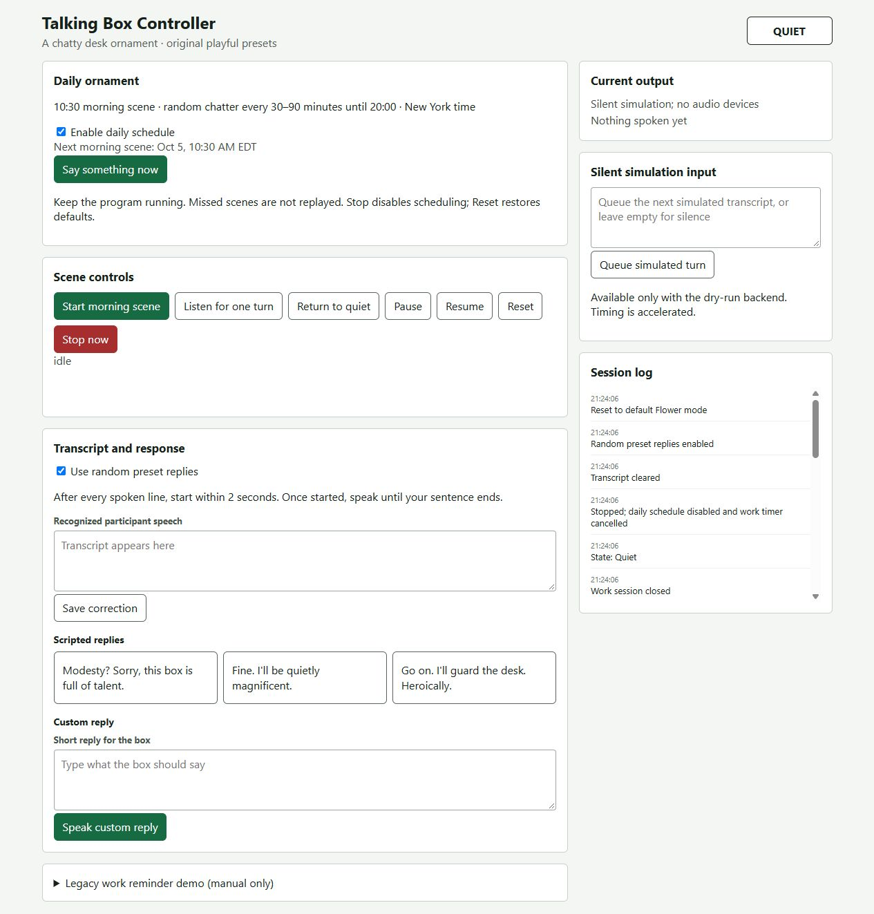

# Talking Box / Flower prototype

A local speech interaction prototype for Lab 3 Part 2. The student chose the ordinary box, the humorous talking-flower character, and the morning/work scenarios. The approved Part 2 direction is an interactive decoration: it occasionally talks to itself and playfully teases anyone who responds. It is a technical baseline, not a completed participant study or final assignment submission.

## Status

**98 tests passed** on Windows Python 3.13.5 and on Raspberry Pi Python 3.11.2. The daily controller and virtual-clock demo were deployed to the Pi on October 4, 2026. Speaker playback was confirmed by the user; the microphone/VAD no-response path and offline recognition of an existing recording passed. The recorded participant demonstration used automatic random speech and manually triggered replies. See the [Lab 3 README](../README.md) for videos and participant feedback. A full live automatic reply cycle and an all-day timing observation are not established by those checks. Earlier validation snapshots remain in [daily verification](docs/DAILY_ORNAMENT.md) and [baseline validation](docs/VALIDATION.md).

## Interactive daily walkthrough

Run `python demo.py` and open <http://127.0.0.1:18766/demo>. Jump to 10:30, the next random event, or 20:00; optionally queue a typed response. This uses the real controller with a separate silent backend and virtual clock. See [demo instructions and the revised storyboard](docs/DEMO.md). Keep the terminal open while demonstrating; Ctrl+C stops it.

## Silent demo on Windows, macOS, or Linux

From this directory, use an existing Python 3.9+ installation. The silent backend uses the Python standard library and does not open audio devices or load models. Daily scheduling also needs an existing IANA timezone database for `America/New_York`; startup reports a clear error if it is unavailable and never silently substitutes the host timezone.

```sh
python -B -m unittest discover -s tests -v
python -B console.py --backend dry-run
# Or run the browser controller:
python -B server.py --backend dry-run --port 18765
```

Use `python3` if that is the Python command on your system. Open <http://127.0.0.1:18765/wizard> for controls and <http://127.0.0.1:18765/participant> for the participant display. The server binds only to 127.0.0.1. Ctrl+C exits; console users can type `quit`.

Dry-run is silent and accelerated. Its initial queue contains one example transcript, followed by silence. `simulate TEXT` queues another response; empty `simulate` queues silence. Reset clears conversation state but does not clear queued simulated input. These are artificial inputs, not participant observations. Daily schedules still follow the wall clock in dry-run; use the manual “Say something now” button or `chatter` to preview without waiting. The tests use an injected clock instead of changing the system clock.

## Interaction

- Keep the program running before **10:30 America/New_York** for the daily morning scene. It runs once per day; a startup after 10:30 does not replay it.
- From 10:30 until **20:00**, choose a random **30–90 minute** wait after each completed interaction, then say a line from the 16-line self-talk pool. Do not start a new autonomous scene at or after 20:00; a conversation already in progress can finish. Manual controls remain available at night.
- After every spoken line, allow **2.0 seconds to start speaking**. Once speech starts, keep the whole utterance until about **0.8 seconds of silence**. These settings are unchanged.
- On a recognized response, choose one of **24 original playful replies**, avoiding the immediately previous line in that pool. Then open another response window. Silence ends the exchange. No general language understanding, semantic matching, advice, or language model is used.
- The two preset pools and daily times live in `talking-box-dialogue.json`: `presets.self_talk`, `presets.replies`, and `daily_schedule`. Restart after editing. Each pool requires at least two distinct, nonempty lines up to 300 characters.
- Pause cancels the current turn and suppresses automatic scenes; Resume starts a fresh daytime waiting interval. **Stop disables the daily schedule** and cancels any legacy work timer; re-enable it explicitly using the daily checkbox or `schedule on`. Reset clears conversation state and restores the configured schedule and random replies.
- The old work reminder is a collapsed, manual-only demo; it is not the daily ornament behavior. The previous 45-minute reminder never starts by itself.
- Native Whisper cancellation still waits for the in-flight computation to return and discards its result. Busy protects the audio devices during cancellation. No wake-word detector is installed; Muse remains an unavailable placeholder.

Main console commands: `morning`, `chatter`, `schedule on/off`, `listen`, `say TEXT`, `simulate TEXT`, `auto on/off`, `pause`, `resume`, `stop`, `reset`, `status`, `help`, `quit`.

## Raspberry Pi setup and verification

This code belongs at `Lab 3/woz_controller/`. Inspect and back up any existing Pi changes before transferring files. Preserve the Lab 3 README, speech scripts, models, voices, existing virtual environment, and `piscreen.service`.

From `Lab 3`, activate the existing environment and perform the read-only prerequisite check:

```sh
source .venv/bin/activate
python3 woz_controller/check_environment.py
```

The Pi backend expects the existing Piper `voices/en_US-lessac-medium.onnx` plus its JSON config, `models/silero_vad.onnx`, local faster-whisper model cache, sounddevice, sherpa-onnx, NumPy, and Linux `aplay`. The prerequisite checker does not prove that the microphone, speaker, or Whisper cache works. Input is 16 kHz mono; output sample rate comes from the voice config. Whisper is configured for local files only.

Only when the operator is ready for real audio, choose one entry point:

```sh
python3 woz_controller/console.py --backend pi --model tiny.en
# Or:
python3 woz_controller/server.py --backend pi --model tiny.en
```

Starting the entry point does not itself capture audio; interaction actions do. Do not run two real-audio instances. Use only an existing authorized SSH connection if a loopback tunnel is needed. Follow the [Pi checklist](docs/PI_CHECKLIST.md); all hardware/participant items remain pending.

## Architecture and limits

`daily_schedule.py` owns the New York wall-clock schedule with an injectable clock. `controller.py` owns states, turn cancellation, random preset selection, and the legacy manual timer. `audio_backend.py` provides the silent backend and the Pi Piper/aplay, Silero VAD, and Whisper adapter. `turn_capture.py` determines onset and end-of-turn from frames. `server.py` and `console.py` share action dispatch; `static/` contains wizard and participant pages.

The participant page distinguishes Quiet, Listening, Thinking, Speaking, and Paused. Audio and transcripts remain in process memory; no participant recording or dataset export is implemented. Room echo, device-open latency, noisy input, and the exact onset boundary still need hardware testing. Persistent noise may prevent the silence endpoint; Stop is the manual escape.

## Screenshots

These show **Windows silent simulation**, not a Pi or participant trial.




## Attribution

The dialogue JSON retains the original scenario and reference provenance. The [Lab 3 README](../README.md) contains the student's reflections and reported participant feedback.
