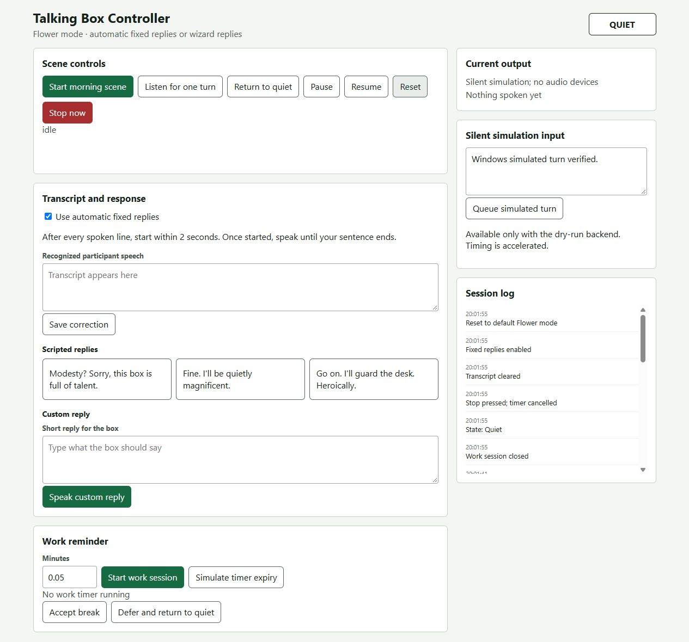

# Talking Box / Flower prototype

A local speech interaction prototype for Lab 3 Part 2. The student chose the ordinary box, the humorous talking-flower character, and the morning/work scenarios. This checkpoint preserves the validated controller and dialogue. It is a technical baseline, not a completed participant study or final assignment submission.

## Status

Windows Python 3.13.5: **70 tests passed, 0 failures, 0 errors, 0 skips**. Silent console and browser checks also passed. Raspberry Pi deployment, real audio, participant trials, and the full 45-minute observation remain pending. See [validation](docs/VALIDATION.md), [Part 2 requirement review](docs/PART2_GAPS.md), and [AI assistance](docs/AI_ASSISTANCE.md).

## Silent demo on Windows, macOS, or Linux

From this directory, use an existing Python 3.9+ installation. The silent backend uses the Python standard library and does not open audio devices or load models.

```sh
python -B -m unittest discover -s tests -v
python -B console.py --backend dry-run
# Or run the browser controller:
python -B server.py --backend dry-run --port 18765
```

Use `python3` if that is the Python command on your system. Open <http://127.0.0.1:18765/wizard> for controls and <http://127.0.0.1:18765/participant> for the participant display. The server binds only to 127.0.0.1. Ctrl+C exits; console users can type `quit`.

Dry-run is silent and accelerated. Its initial queue contains one example transcript, followed by silence. `simulate TEXT` queues another response; empty `simulate` queues silence. Reset clears conversation state but does not clear queued simulated input. These are artificial inputs, not participant observations.

## Interaction

- Start the morning scene from the controller. The box speaks to itself, then greets the participant. An answer to the first line is handled before continuing, avoiding an overlapping greeting.
- After each spoken line, the participant has **2.0 seconds to begin speaking**. Once speech starts, capture continues until approximately **0.8 seconds of silence**. Two seconds is not the length limit for the whole answer.
- Automatic mode uses a fixed scripted reply, then opens another response window. It does not interpret arbitrary questions or generate new answers. Disable automatic replies for a wizard to read/correct the transcript and choose a scripted or custom reply.
- Work mode acknowledges the request, finishes its response window, and starts a 45-minute timer. A background scheduler issues one movement reminder. `work 0.05` uses a three-second test timer. Accept/defer are wizard controls, not recognized spoken intents.
- Pause cancels the current turn and freezes the timer. Resume returns to Quiet and restores the remaining time. Stop cancels the turn and timer. Reset also clears transcript/output/errors and restores automatic fixed replies.
- An interrupted native Whisper call may take time to return. Its result is discarded; wait until the audio worker has finished before starting another action. The controller reports Busy while cancellation completes.
- Morning activation is manual. There is no enabled morning alarm or wake-word detector. Muse is an unavailable placeholder interface; no pairing or transport is implemented.

Console commands: `help`, `status`, `morning`, `listen`, `say TEXT`, `simulate TEXT`, `work MINUTES`, `remind`, `accept`, `defer`, `auto on/off`, `pause`, `resume`, `stop`, `reset`, `quit`.

## Raspberry Pi setup and verification

This code belongs at `Lab 3/woz_controller/`. Inspect and back up any existing Pi changes before transferring files. Preserve the Lab 3 README, speech scripts, models, voices, existing virtual environment, and `piscreen.service`.

From `Lab 3`, activate the existing environment and perform the read-only prerequisite check:

```sh
source .venv/bin/activate
python3 woz_controller/check_environment.py
```

The Pi backend expects the existing Piper `voices/en_US-lessac-medium.onnx` plus its JSON config, `models/silero_vad.onnx`, local faster-whisper model cache, sounddevice, sherpa-onnx, NumPy, and Linux `aplay`. The prerequisite checker does not prove that the microphone, speaker, or Whisper cache works. Input is 16 kHz mono; output sample rate comes from the voice config. Whisper is configured for local files only.

Only when the operator is ready for real audio, choose one entry point:

```sh
python3 woz_controller/console.py --backend pi --model tiny.en
# Or:
python3 woz_controller/server.py --backend pi --model tiny.en
```

Starting the entry point does not itself capture audio; interaction actions do. Do not run two real-audio instances. Use only an existing authorized SSH connection if a loopback tunnel is needed. Follow the [Pi checklist](docs/PI_CHECKLIST.md); all hardware/participant items remain pending.

## Architecture and limits

`controller.py` owns states, turn cancellation, fixed dialogue, and the timer. `audio_backend.py` provides the silent backend and the Pi Piper/aplay, Silero VAD, and Whisper adapter. `turn_capture.py` determines onset and end-of-turn from frames. `server.py` and `console.py` share action dispatch; `static/` contains wizard and participant pages.

The participant page distinguishes Quiet, Listening, Thinking, Speaking, and Paused. Audio and transcripts remain in process memory; no participant recording or dataset export is implemented. Room echo, device-open latency, noisy input, and the exact onset boundary still need hardware testing. Persistent noise may prevent the silence endpoint; Stop is the manual escape.

## Screenshots

These show **Windows silent simulation**, not a Pi or participant trial.




## Attribution

The dialogue JSON retains the original scenario and reference provenance. See [AI assistance](docs/AI_ASSISTANCE.md) for the technical work and its evidence limits. Personal reflection and participant findings have not been generated or filled in.
