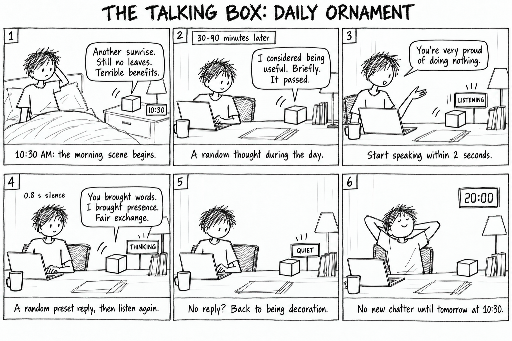

# Daily ornament demo

Run from `woz_controller/` on Windows or a machine with Python and an IANA timezone database:

```bash
python demo.py --port 18766
```

Open http://127.0.0.1:18766/demo. Keep the terminal open. Stop with Ctrl+C.

The demo uses the production `TalkingBoxController`, `DailySchedule`, and dialogue JSON. A separate backend supplies typed transcripts and visible pacing; it does not load speech models, open audio devices, change system time, or contact a Pi. Its clock starts at October 4, 2026, 10:29:59 in New York and remains frozen between steps.

## Two-minute walkthrough

1. Leave **这次模拟用户搭话** unchecked and click **到 10:30，开始早晨**. With no reply to the opening, the box pauses and says its second morning line, then becomes Quiet.
2. Check **这次模拟用户搭话**, edit the example sentence if desired, and click **跳到下一次随机闲聊**. This jumps exactly to the real scheduler's randomly selected deadline, 30–90 minutes after the last exchange. Observe Speaking → Listening → Thinking → Speaking → Listening → Quiet. The reply comes from the 24-line preset pool, not from interpretation of the sentence.
3. Uncheck the response option and try another random event. No response ends the turn without a preset reply.
4. Click **跳到 20:00**. No new autonomous utterance begins; the next event is tomorrow at 10:30. **重新演示** cancels any current exchange and restores the initial clock.

Each click can queue one simulated utterance. Later response windows are silent. Clock-jump controls wait for an active exchange to finish. The full wizard and participant screens are linked below the demo and share its simulated state.

## Evidence boundary

Speaking lasts 1.8 seconds per line and Thinking uses 0.6 seconds for visibility. These are presentation timings, not Pi latency measurements. The real response-start and endpoint settings remain 2 seconds and 0.8 seconds. This demo cannot validate a microphone, VAD accuracy, speech recognition, speaker quality, actual response latency, or user experience. Participant research and physical Pi acceptance are pending.

## Storyboard



Six imagined panels reuse the original plain cube, person, and rough black-and-white English sketch style. Panel 4 compresses successive Thinking and Speaking states into one illustration; the screen switches to Speaking during actual output. Panel 6 describes new autonomous speech; an already active exchange may finish after 20:00. The morning scene can include its second greeting when the first line receives no answer. The sampled lines illustrate the preset pool and are not guaranteed in each run.

Generated with the built-in image generation tool using the original Notion storyboard as a style reference. The student supplied the concept and new daily schedule; Codex assisted with implementation, writing, and illustration. Prompt retained in `storyboard-prompt.txt`.
